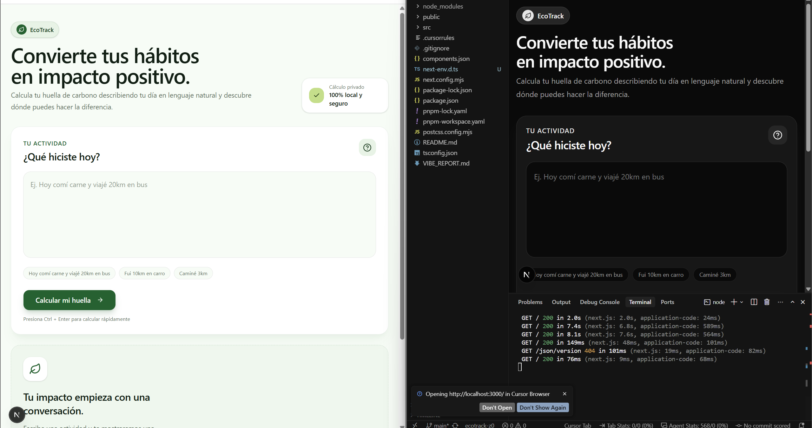
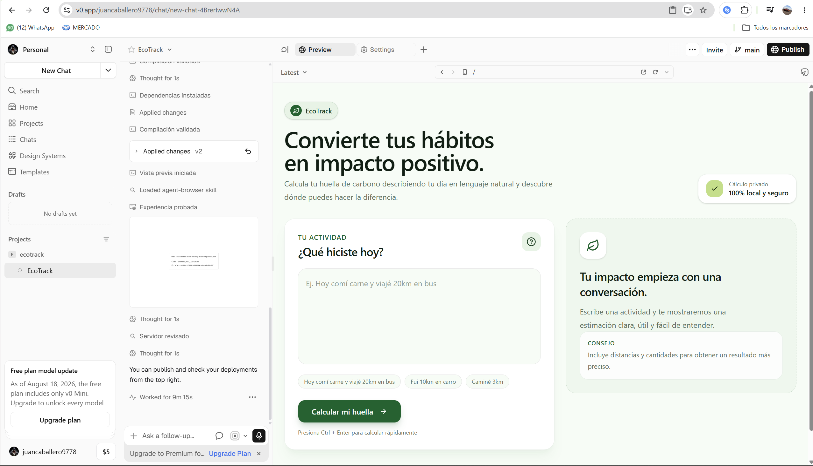

# EcoTrack — MVP de Huella de Carbono 
*Proyecto Integrador: Configuración del Ecosistema y Primer "Vibe"*

**Autor:** Juan Pablo Caballero Castellanos

Aplicación web interactiva diseñada para registrar y estimar la huella de carbono diaria a partir de descripciones cotidianas en lenguaje natural (por ejemplo: *"Hoy comí carne y viajé 20 km en bus"*). Este proyecto fue desarrollado bajo la metodología de **Vibe Coding**, donde la arquitectura, las reglas y la visión del producto se definieron previamente, delegando la construcción, el diseño y la integración a agentes de IA (Cursor y v0).

---

## 🔗 Enlaces del Proyecto

- **Repositorio en GitHub:** [https://github.com/JuanCaballero9778/ecotrack-z0](https://github.com/JuanCaballero9778/ecotrack-z0)
- **Demo en Vercel (Producción):** [https://ecotrack-sepia-ten.vercel.app/](https://ecotrack-sepia-ten.vercel.app/)

---

## 🧰 Stack Tecnológico

- **Framework:** Next.js (App Router)
- **Lenguaje:** TypeScript
- **Estilos:** Tailwind CSS
- **Lógica de Negocio:** Parser local en español basado en reglas deterministas y factores de emisión estáticos (sin dependencias de APIs externas).

---

## 🗂️ Estructura de Entregables en el Repositorio

| Entregable | Ubicación en el Repositorio | Descripción |
| :--- | :--- | :--- |
| **Reglas del Agente** | `.cursorrules` | Archivo raíz que define el rol, el stack y las restricciones de la IA. |
| **Vibe Report (Reflexión)** | `VIBE_REPORT.md` | Documento de análisis sobre la experiencia de desarrollo asistido. |
| **Interfaz Visual (UI)** | `src/app/page.tsx` | Componente principal optimizado y diseñado mediante v0. |
| **Parser y Lógica** | `src/lib/` | Módulos encargados de procesar el texto e interpretar las emisiones. |
| **Capturas del Entorno** | `docs/images/` | Evidencias visuales del funcionamiento conjunto de Cursor y v0. |

---

## 🖥️ Flujo de Trabajo (Metodología Vibe Coding)

1. **Configuración del Entorno:** Se estableció el archivo `.cursorrules` en Cursor para condicionar a la IA a generar código modular, limpio y estrictamente tipado.
2. **Prototipado Visual:** Se utilizó **v0.dev** para generar el diseño de la interfaz (frontend) enfocado en una experiencia de usuario limpia, responsiva y con temática ecológica.
3. **Integración y Lógica:** Se trasladó la interfaz al entorno local para que el agente de Cursor estructurara el procesamiento del lenguaje natural y la calculadora de CO2.
4. **Despliegue Continuo:** Sincronización directa del repositorio con **Vercel** para asegurar una URL pública funcional e inmediata.

---

## 🧪 Ejemplo de Prueba Funcional

- **Entrada del usuario:** `"Hoy comí carne y viajé 20 km en bus"`
- **Salida esperada del sistema:** Cálculo estimado desglosado (ej. desglose de transporte en autobús + porción de consumo de carne, arrojando el total de kg de $CO_2$ equivalente).

---

## 🖼️ Evidencia del Ecosistema

*Entorno de desarrollo operando en conjunto (Cursor y v0):*

## 📸 Evidencia del Entorno
